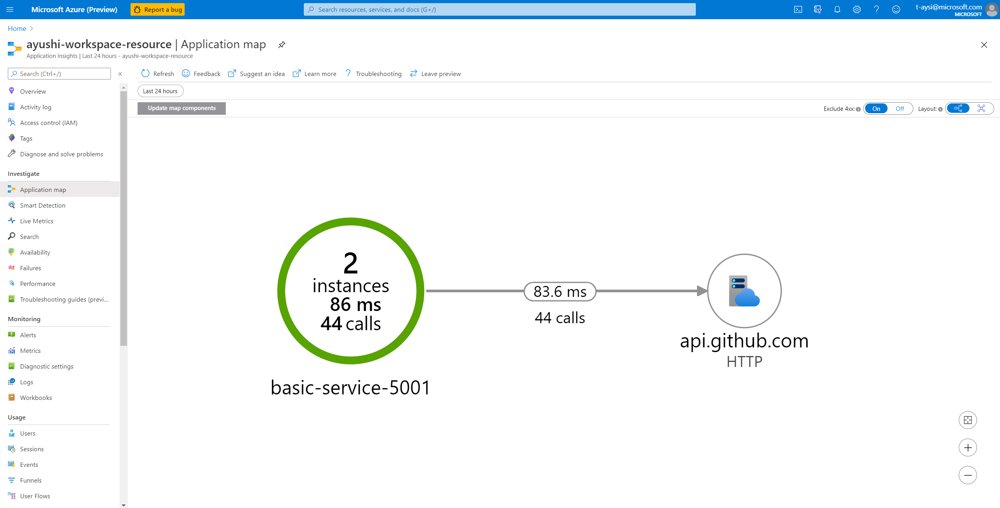
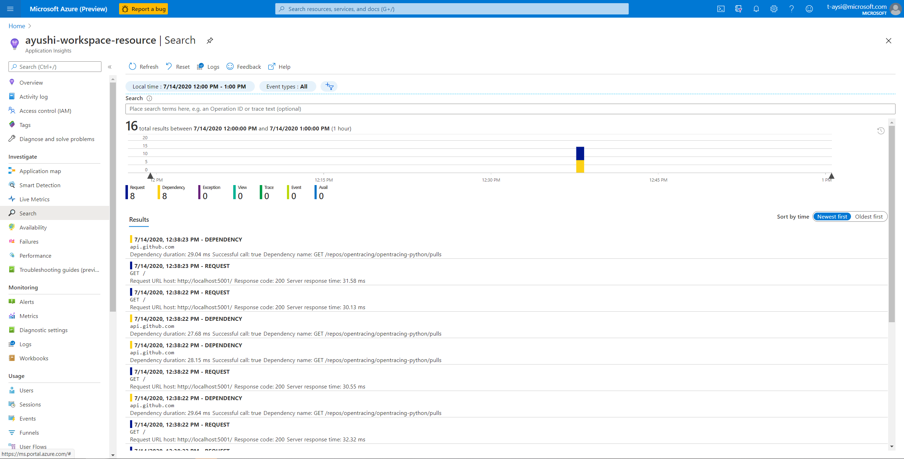

# Private Preview Instructions 
## Container Insights Agent Integration with OpenTelemetry Collector
Intended for those looking to use an integrated version of the Container Insights agent and OpenTelemetry collector (deployed as a kubernetes service) to obtain both infrastructure and application insights. This integration is currently only available with the Linux Agent. 

## Pre-requisites
1. [Workspace-based Application Insights Resource](https://docs.microsoft.com/en-us/azure/azure-monitor/app/create-workspace-resource)
2. [AzureMonitor-Containers Solution added to your Log Analytics workspace](https://github.com/Microsoft/OMS-docker/blob/ci_feature_prod/docs/solution-onboarding.md)
3. [An app instrumented with OpenTelemetry](https://opentelemetry.io/)

## Precautions
Currently, this solution supports requests and dependencies but not logs or metrics when ingesting application telemetry data. If you are currently using the Application Insights SDK to instrument and monitor your apps, this solution will not be supporting all the features avaiable in Application Insights. If Application Insights supports the language of your application and you wish to be able to have feature-rich functionality, please use the Application Insights SDK, or use this solution but be aware of its limitations. If Application Insights does not have support for your language, this is a great solution to be able to see application-level insights.

## Install Chart
Add the repo: 
```
helm repo add open-telemetry https://ayusheesingh.github.io/helm-chart/
```
Confirm it's been added by checking `open-telemetry` is listed:
```
helm repo list 
```
Go to your Log Analytics workspace in the Azure Portal, click on "Advanced Settings" > "Connected Sources" > "Agents management", and retrieve your workspace ID (<your_wsid>) and primary key (<your_key>) from there. Similarly, get your Application Insights resource instrumentation key (<your_instrumentation_key>) from the "Overview" tab in Azure Portal. Replace these values in the command below and run.
```
helm upgrade --install azmon-containers-release-1-ot --set omsagent.instrumentationKey=<your_instrumentation_key>,omsagent.secret.wsid=<your_wsid>,omsagent.secret.key=<your_key>,omsagent.env.clusterName=<your_cluster_name>  open-telemetry/azuremonitor-containers
```

## Verify Installation
Confirm `azmon-containers-release-1-ot` is listed:
```
helm list 
```
Confirm `omsagent-otel` is running:
```
kubectl get deployments -n kube-system
```

## Configure OpenTelemetry Collector Receiver
By default, OTLP is configured to be the receiver for the collector. If you wish to change it to OpenCensus, you will need to edit the collector configuration. Note: the OpenCensus configuration is commented out for convenience. 

To get all configmaps (to see the current collector configuration), run:
```
kubectl get configmap -n kube-system 
```
If you would like to switch to using OpenCensus, uncomment the lines with "opencensus", and comment the ones with "otlp". Edit this configuration by running: 
```
kubectl edit configmap <configmap-name> -n kube-system
```

## Configure application 
Make sure your app that is being instrumented with OpenTelemetry is configured to the appropriate endpoint based on the exporter you are using. If you are using the OTLP exporter, it must be specified to have `endpoint="omsagent-otel.kube-system:55680"` (OTLP's default endpoint). If you are using the OpenCensus exporter, use `endpoint="omsagent-otel.kube-system:55678"`. In order for the collector to work as expected, these ports must be available.

## Verify data ingestion
Run your application, and see your traces in Application Insights. Data should be available under "Investigate" in Application Map and in Search. Below is an image of what this data can look like.



## Limitations
If you use Jaeger to instrument your applications, there may be some discrepancies in the way the data is rendered on the Application Map and Log Analytics due to span type mismatch. 

## Contact
If you run into issues, feel free to reach out to t-aysi@microsoft.com, or visit the instructions for a sample Python application in `~/Docker-Provider/source/opentelemetry-collector-contrib/examples/tracing` and confirm that you can see data coming into Application Insights.
